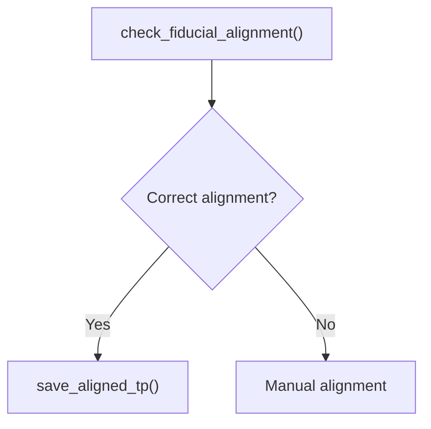
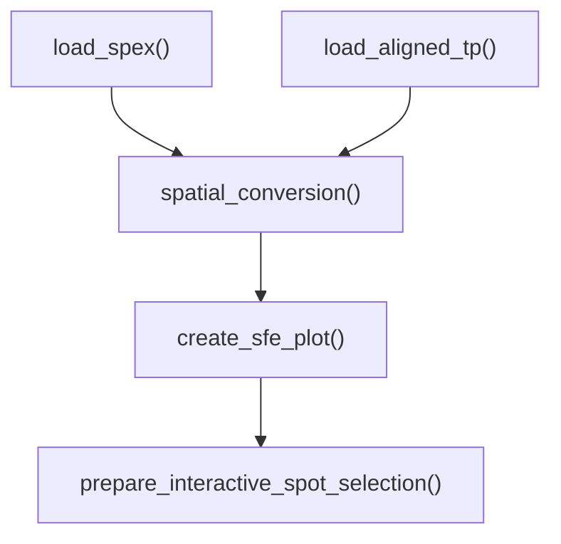

# visiumSpatialSolutions

`visiumSpatialSolutions` provides tools for spatial reconstruction, 
visualization, and interactive analysis of non-HD Visium spot-based arrays, 
including:

- validation of detected fiducial markers,
- conversion between array and pixel spot positions into spatial dimensions,
- spatially resolved visualization,
- interactive spot selection within the spatially resolved image,
- visualization and interactive adjustments of selected spot positions, and
- download of interactively selected spot. 

---

# Introduction

Visium spatial output provides array indices and image coordinates, but the physical placement of spot centres within the stated capture-area dimensions is not fully specified. After evaluation of [Reconstruction models](https://Zockimonster.github.io/visiumSpatialSolutions/docs/Reconstruction_models.html), feasible spatially resolved spot positions were integrated to a `SpatialFeatureExperiment` object, and the underlying image was adjusted to match the spatial dimension.

Furthermore, we added functions for visualization of the spatially resolved image overlaid by the spatially resolved spot positions, as well as tools for interactive spot selection and modification.

> **Object representation**
>
> Spatially reconstructed spot positions remain available for downstream
> analysis with other tools. `SpatialFeatureExperiment` is used as primary
> object representation source, because it can represent both spot-centre 
> coordinates and spot geometries.

---


# Installation

You can install the development version of visiumSpatialSolutions from [GitHub](https://github.com/Zockimonster/visiumSpatialSolutions) with:

``` r
# install.packages("devtools")
# devtools::install_github("Zockimonster/visiumSpatialSolutions")
# or
# install.packages("remotes")
remotes::install_github("Zockimonster/visiumSpatialSolutions")
```

---

# Visium spatial-array geometry

The derivation and visualization of candidate physical coordinate
reconstructions for 6.5 mm and 11 mm Visium arrays are available in
[Reconstruction models](https://Zockimonster.github.io/visiumSpatialSolutions/).

---

# Exported functions

## Alphabetical Overview

| Function                               | Purpose                                                                         |
| :------------------------------------- | :-------------------------------------------------------------------------------|
| `adjust_img_size()`                    | Resize an image array                                                           |
| `check_fiducial_alignment()`           | Check fiducial frame detection & align tissue image, array, and pixel positions |
| `create_sfe_plot()`                    | Plot a spatially aligned Visium image and spot geometry                         |
| `load_aligned_tp()`                    | Load aligned Visium tissue positions                                            |
| `load_spex()`                          | Load a `SpatialExperiment` Object for a 10x Genomics Visium sample              |
| `load_tp()`                            | Load Visium tissue positions                                                    |
| `prepare_interactive_spot_selection()` | Prepare an interactive Visium spot-selection application                        |
| `save_aligned_tp()`                    | Save aligned Visium tissue positions                                            |
| `spatial_conversion()`                 | Convert Visium array and pixel coordinates to physical coordinates              |


## Functions within the Workflow

**Fiducial Detection**



> **Reorientation**
>
> If `check_fiducial_alignment()` indicates an orientation problem, [manual
> fiducial alignment](https://www.10xgenomics.com/support/software/space-ranger/latest/analysis/inputs/image-fiducial-alignment)
> using Loupe Browser and Space Ranger is the recommended workflow for proper reorientation. 


**Spatial Resolution**



---

# Example workflow

## Define settings

```r
# visium directory with sample folder and 
# SpaceRanger output format
visium_dir <- "path/to/visium/sample/folder"
# name of the visium sample directory
visium_sample <- "Sample"
# matrix gene and spot set to be used (filtered or raw)
mtx_name <- "filtered"
# matrix type to be used (h5 or sparse)
mtx_type <- "sparse"
# image resolution to be used (lowres or hires)
res_img <- "lowres"
# Length of squared capture area
L <- 6500
# output directory for saving created files
out_dir <- "path/to/save/file"
```


## Check Fiducial Alignment

For correct Fiducial Detection, the hollow circles must match the grey dots 
in the four corners (Fiducial Markers), as well as for the lines in between 
(Fiducial Frame). If the tissue positions of the array or the pixels don't match the 
image, you can adjust the orientation using the `adjust_array` resp. `adjust_pixels`
arguments in the function.

The `adjust_array` resp. `adjust_pixels` arguments enable 3 reorientation steps 
in the following order:

1) `swap`: changes the row and column axis 
2) `x` mirrors the row positions (min <-> max)
3) `y` mirrors the column positions (min <-> max)

```r
library(visiumSpatialSolutions)
check_alignment <- check_fiducial_alignment(
visium_dir=visium_dir, 
visium_sample=visium_sample,
tp_file_name="tissue_positions_list.csv",
adjust_array = "y", 
adjust_pixels = "y")
# save aligned tissue positions
utils::write.csv(check_alignment$tp, 
file = file.path(out_dir,paste0("aligned_tissue_positions_",visium_sample,".csv")), 
row.names = FALSE)
```

---

## Spatially resolved data

### Load input data

```r
spex <- load_spex(
visium_dir=visium_dir, 
visium_sample=visium_sample, 
matrix_name=mtx_name,  
matrix_file_type=mtx_type, 
image_resolution=res_img)
tp_aligned <- load_aligned_tp(
file_dir=out_dir, 
visium_sample=visium_sample)
```

---

### Spatial Transformation

$$
x_{img} = p_{col} \ \wedge \  y_{img} = y_{max} −p_{row} \\
\Rightarrow X = k_x + sf_x * x_{img} \ \wedge \  Y = k_y + sf_y * y_{img}
$$

```r
sfe <- spatial_conversion(
aligned_tp=tp_aligned, 
spex=spex, 
L_capture_area=L,  
image_resolution=res_img)
```


### Spatially resolved plot


```r
# create plots for`spatial_pixels` colGeometries (default)
sfe_plot <- create_sfe_plot(
sfe = sfe, 
image_resolution=res_img)
```

---

Deviations - > `spatial_array`

---

## Interactive Spot Selection

The `SpatialFeatureExperiment` object with the spatially aligned array and pixel positions can further be used for interactive spot selection, 
and can be dowloaded as `csv` file  using the `Download selected spots` button within the application:

```r
p_ia <- prepare_interactive_spot_selection(
sfe= sfe, 
image_resolution=res_img)
shiny::shinyApp(p_ia$user_interface, p_ia$server_settings)
```
---

# Vignettes

Further information on available functions provided within the package, 
and parameter adjustments, can be found in the package vignettes

1) [Fiducial Detection](https://Zockimonster.github.io/visiumSpatialSolutions/docs/Fiducial_Detection.html)
2) [Spatial Resolution](https://Zockimonster.github.io/visiumSpatialSolutions/docs/Spatial_Resolution.html)

